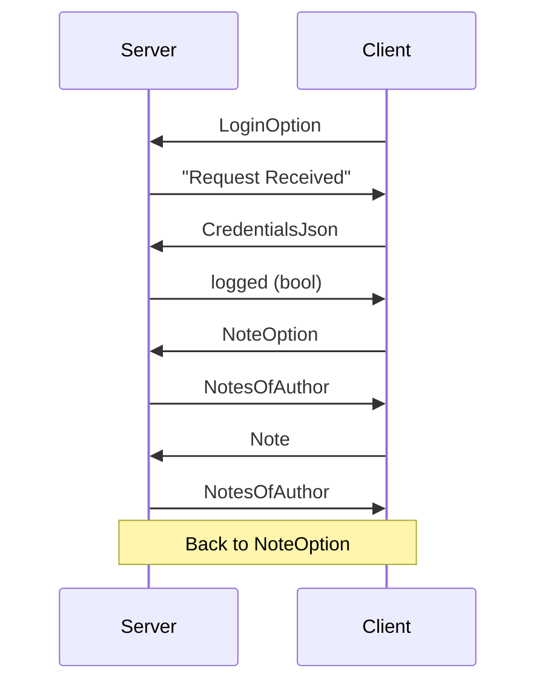

# NetNote

A TCP Note-Taking application written in Rust and Java.

# Server

The server is in charge of handling users and notes, and storing them to file.

# Client

The client makes the user create, delete and edit notes.

