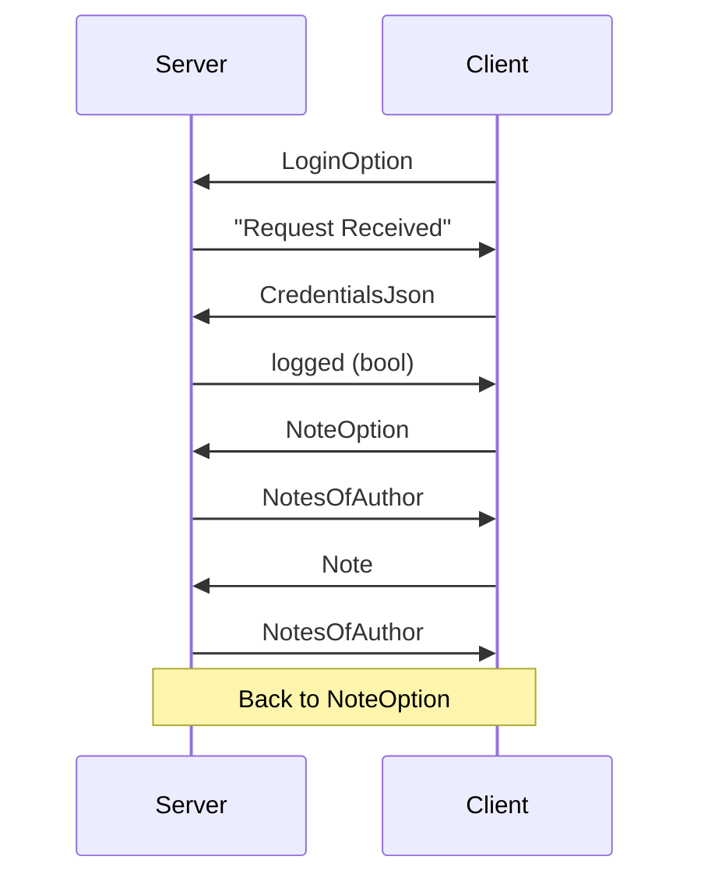

<h1 align="center">
    
</h1>

<p align="center">
  <i align="center">A TCP Note-Taking application 🖋</i>
</p>


# NetNote

A TCP Note-Taking application written in Rust and Java.

**Authors**:

- [Francesco Lanza](https://github.com/fralnz)

- [Riccardo Silvestri](https://github.com/RiccardoSilvestri)

# Main Features

NetNote offers a variety of features that make it a compelling note-taking application:

- **User management**: the users are able to register and log in to the server, so that only they can read their notes.

- **Security**: user passwords are cypted using `sha256`.

- **Note management**: users are able to create, edit and delete notes.

- **User Interface**: each point above can be done using our user-friendly interface.

## Binaries

You can download the binaries in the [release](https://github.com/RiccardoSilvestri/UFS-02/releases/).

## Arguments

The client accept two arguments, the serverName and port. If one or more are missing, it uses the default ones:

```java
private static String serverName = "localhost";
private static int port = 4444;
```

**Example:**

```bash
JavaClient localhost 4444
```

## 

## TCP Connection

Client and Server communicate through **TCP**.

This is a graph of the exchange of messages:



## Compile Server

To compile the server, you need to have `cargo` installed.

```bash
cd RustServer
cargo build
```

## Compile Client

Open the project in IntelliJ Idea, set a build artefact and set the main class to Launcher. Build the artefact.

---

# Server

The server is in charge of handling users and notes, and storing them to file.

## Arguments

It accepts two arguments, which are `localhost` and `port`.

If there is only one argument and it's an integer, the server assumes it's the `port`, otherwise it's the `localhost`.

If an argument or more is missing, the server uses the default values:

```rust
let hostname = "0.0.0.0";
let port = 4444;
```

Example:

```bash
RustServer 127.0.0.1 4444
```

## Dependencies

All the dependencies are specified into `Cargo.toml`:

```rust
serde_json = "1.0.114"
serde = { version = "1.0.197", features = ["derive"] }
colored = "2.0"
```

- `serde `and `serde_json`: handle jsons.

- `sha2`: get the hash of the user passwords.

- `colored`: display colored text.

## User Management

All users are stored into `users.json`. Here's an example:

```json
[
  {
    "name": "francesco",
    "password": "31cc6d61586c752d1e6542b31fe43126987c5fa2bab6f8e40031ac0692217b25"
  },
  {
    "name": "ciccio",
    "password": "919b1ad5eaad169ec53df1442d24b8de39c2cd7f7a90a1c51cab4753b546480f"
  },
  {
    "name": "riccardo",
    "password": "ad676259cca7d79a07e674e4db88b4d2feab7eabbd9792bff810099dd7338c1"
  },
  {
    "name": "antonio",
    "password": "a19e140d738643ad04991806855ddffea822f66cde025df8bc858e0bab80e381"
  }
]
```

As you can see, all user names are lowercase and all the passwords are hashed, so that they're not passed in clear through the connection.

If `users.json` doesn't exist or is empty, the server automatically creates it and makes it a json array.

## Note Management

Much like the users, all notes are stored in `received.json`. Here's an example:

```json
[
  {
    "author": "antonio",
    "content": "note test",
    "date": "Wed Apr 10 10:39:44 2024",
    "title": "test"
  },
  {
    "author": "antonio",
    "content": "hello\nworld",
    "date": "Wed Apr 10 10:39:56 2024",
    "title": "using json"
  },
  {
    "author": "francesco",
    "content": "another\ntest",
    "date": "Wed Apr 10 16:04:23 2024",
    "title": "ciao"
  }
]
```

The notes are not hashed, because othorwise they can't be read.

## Concurrency

The server spawns a thread each time a client connects:

```rust
for stream in listener.incoming() {
    match stream {
        Ok(stream) => {
            let file_access_clone = Arc::clone(&file_access);
            let _ = thread::spawn(move || {
                let result = std::panic::catch_unwind(|| {
                    handle_client(stream, file_access_clone);
                });
                if let Err(_panic) = result {
                    eprintln!("A client connection caused a thread to panic.");
                }
            });
        }
        Err(e) => { eprintln!("Unable to connect: {}", e); }
    }
}
```

Since each thread will be able to read and write into users.json and `received.json`, in `handle_client.rs` the server passes the `stream` and `file_access_clone`, which is a mutex.

Every time a function has access to a file, we lock the mutex with:

```rust
let _guard = file_access.lock().unwrap();
```

When the mutex goes out of scope, it's automatically dropped.

---

# Client

The client is in charge of sending instructions to the server from a clean user interface.

## User Interface

The client uses JavaFX for its user interface. It has 2 main Windows:

- Log-in;

- Note Management.

### Log-in Window

The first window the user is prompted to is the Log-in one, named `MainWindow`.

Here, the user can enter username and password into `TextBoxes` and press the button "Sign in" or "Sign up".

Also, there is handy text label on the bottom left of the window that indicates the server status.

### Note Management Window

Once the user is logged in, they are presented with an array of button, each representing a note they made (empty if they just signed up).

The content of the selected note is displayes on an inputbox, so that it's editable..
